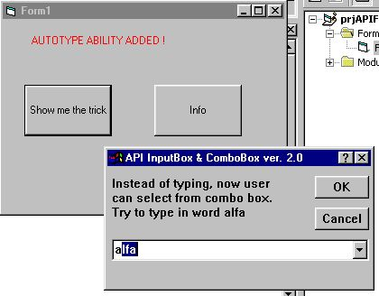



## APIInputBox&ComboBox

### Description

Bugs fixed, autotype ability added. This was hard to figure out as API combo box doesnt get WM_CHAR message + some others neat adds.
 
### More Info
 

             |
---                |---
**Submitted On**   |2002-04-28 11:30:52
**By**             |[M\.C](https://github.com/Planet-Source-Code/PSCIndex/blob/master/ByAuthor/m-c.md)
**Level**          |Advanced
**User Rating**    |5.0 (15 globes from 3 users)
**Compatibility**  |VB 5\.0, VB 6\.0
**Category**       |[Windows API Call/ Explanation](https://github.com/Planet-Source-Code/PSCIndex/blob/master/ByCategory/windows-api-call-explanation__1-39.md)
**World**          |[Visual Basic](https://github.com/Planet-Source-Code/PSCIndex/blob/master/ByWorld/visual-basic.md)
**Archive File**   |[APIInputBo79895562002\.zip](https://github.com/Planet-Source-Code/m-c-apiinputbox-combobox__1-34496/archive/master.zip)

